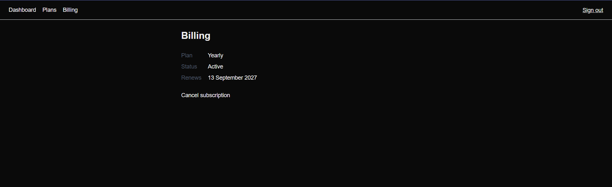

# Subscription & Billing Slice

A full-stack subscription and billing system built with Next.js, TypeScript, PostgreSQL, Prisma and Flutterwave.

The project explores the engineering behind subscription products: payment verification, subscription state, upgrades, downgrades, proration, cancellation, entitlements and reliable payment-event handling.

## Preview



## What It Does

- Supports Free, monthly and yearly subscription plans
- Initiates payments through Flutterwave
- Verifies payments before granting access
- Tracks subscription and billing state
- Handles plan upgrades with proration
- Schedules downgrades for the appropriate billing period
- Supports cancellation while retaining access until the paid period ends
- Maintains payment and subscription lifecycle records
- Protects authenticated billing routes
- Validates user input and payment operations
- Includes automated tests for critical billing logic

## Engineering Decisions

### Payment verification

A successful redirect from a payment provider is not treated as proof of payment.

The application verifies the transaction with Flutterwave before subscription access is granted.

### Idempotent fulfilment

Payment processing is designed so that the same successful transaction cannot grant the same entitlement multiple times.

This is important because payment callbacks and webhook-style events may be delivered more than once.

### Payment event history

Payment activity is recorded so the lifecycle of a transaction can be inspected rather than relying only on the current subscription state.

This provides better traceability when debugging payment and subscription behaviour.

### Proration

When a user upgrades during an active billing period, the system calculates the value remaining on the current plan and uses it when determining the upgrade amount.

### Downgrades

Downgrades are scheduled rather than immediately removing access the customer has already paid for.

### Cancellation

Cancelling a subscription stops future renewal while allowing the customer to retain access through the end of the current paid period.

### Entitlements

Access is derived from subscription state and billing periods instead of simply checking whether a user has ever completed a payment.

## Tech Stack

- Next.js
- TypeScript
- React
- PostgreSQL
- Prisma
- Flutterwave
- Zod
- Vitest
- Tailwind CSS

## Architecture

The application separates authentication, payment integration and subscription-domain logic.

```text
app/
├── api/                 # API routes
├── (auth)/              # Authentication flows
└── (app)/               # Billing and subscription UI

lib/
├── auth/                # Sessions, passwords and tokens
├── flutterwave/         # Payment provider integration
├── cancellation.ts      # Cancellation lifecycle
├── downgrade.ts         # Scheduled downgrade logic
├── entitlement.ts       # Access/entitlement rules
├── fulfilCheckout.ts    # Payment fulfilment
├── paymentLog.ts        # Payment event history
├── proration.ts         # Upgrade calculations
├── upgradeConfirm.ts    # Upgrade fulfilment
└── upgradeQuote.ts      # Upgrade pricing

prisma/
├── schema.prisma
└── migrations/

evidence/                # Implementation and lifecycle evidence
```

## Testing

Critical subscription logic is covered with Vitest tests, including:

- Payment fulfilment
- Payment logging
- Entitlements
- Proration
- Upgrades
- Downgrades
- Cancellation
- Billing periods

Run the test suite with:

```bash
npm test
```

## Evidence

The [`evidence`](./evidence) directory contains screenshots covering the subscription lifecycle, including plan selection, payment processing, upgrades, downgrades, cancellation and retained access.

## Running Locally

Clone the repository:

```bash
git clone https://github.com/ScrappyAT/subslice.git
cd subslice
npm install
```

Copy the environment template:

```bash
cp .env.example .env
```

Configure PostgreSQL and Flutterwave test credentials in `.env`, then run the database migrations and start the application.

```bash
npx prisma migrate dev
npm run dev
```

Open `http://localhost:3000`.

Flutterwave credentials should use **test mode** when running the project locally.

## Environment Variables

See [`.env.example`](./.env.example) for the required configuration.

Secrets and payment-provider credentials should never be committed to the repository.

## Engineering Documentation

For the detailed implementation notes, design decisions, payment flows and assessment evidence, see:

[DOCUMENTATION.md](./DOCUMENTATION.md)

## What I Learned

This project pushed me beyond simply connecting an application to a payment API.

The more important engineering work was reasoning about what happens around a payment: duplicate events, verification, subscription state transitions, upgrades, downgrades, cancellation, billing periods and determining what a customer should actually be allowed to access.

It reinforced that payment systems are primarily state and reliability problems, not just checkout-page integrations.

## Project Context

Built as part of my Product Design & Engineering Bootcamp work, with a focus on subscription systems, payment integration and reliable product behaviour.
